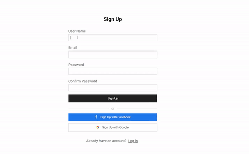

# React Sign Up and Log In

  

## ⚙️ Features

**[Sign Up]**

- A user can create an account in three different ways: using own email, Facebook account, or Google account.
- Once sign up is completed, user data (email, username) are saved in Firebase Firestore.
- Any falsy values on the inputs can be detected and show an alert message if there are any errors.

**[Log In]**

- A user can log in with email, Facbook account, or Google account.
- If email does not exist, an alert message is shown.

**[Dashboard]**

- A user is able to change his/her user name, email address, or profile photo.
- If a user changes and saves data, they are updated on Firestore and Storage accordingly.

## 📌 Lessons from the project

- Learned how to implement CRUD application in React with Firebase Web SDK.
- Understood set ups to use React Context.
- Set up routings with React Router.

## 👩🏻‍🔧 Future Improvement

- Organize codes by reducing repetitive codes especially on Dashboard component.

## 💻 Technologies

- SCSS
- React
- Firebase

## 🔨 Set up

- Download and install Git
- `> git clone https://github.com/chepark/react-signup-login.git`
- `> npm install`
- `> npm start`
